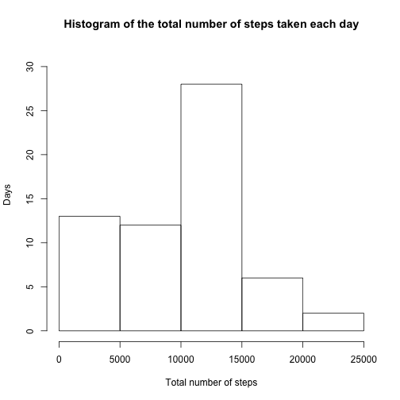
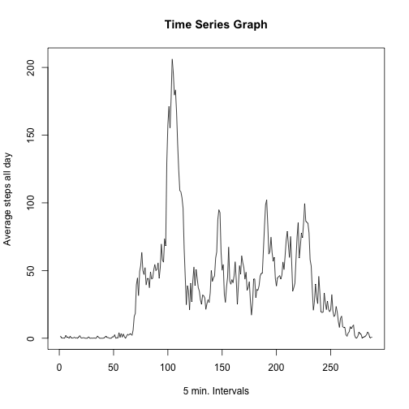
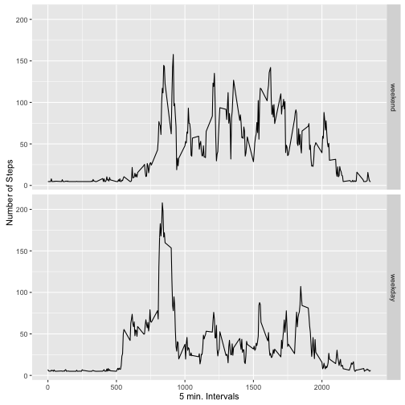

## Loading and preprocessing the data

This command assign to variable called "Data" the observations and variables contained in file called "activity.cvs":


```r
Data <- read.csv("./data/activity.csv")
```

```
## Warning in file(file, "rt"): cannot open file './data/activity.csv': No
## such file or directory
```

```
## Error in file(file, "rt"): cannot open the connection
```

## What is mean total number of steps taken per day?


```r
steps_by_day <- tapply(Data$steps, Data$date, FUN = sum, na.rm = TRUE)

hist(steps_by_day,
     main = "Histogram of the total number of steps taken each day",
     xlab = "Total number of steps",
     ylab = "Days",
     ylim = c(0,31))
```



```r
mean_steps <- mean(steps_by_day); median_steps <-median(steps_by_day)
```

The **mean** of steps is: **9354.23**  
The **median** of steps is: **10395**

## What is the average daily activity pattern?


```r
time_serie_plot <- tapply(Data$steps, Data$interval, FUN = mean, na.rm = TRUE)

plot(time_serie_plot,
     type = "l",
     xlab = "5 min. Intervals",
     ylab = "Average steps all day", 
     main = "Time Series Graph")
```



```r
max_avg_interval <- which.max(time_serie_plot)
max_avg_steps<-time_serie_plot[[which(names(time_serie_plot) == names(max_avg_interval))]]
```

The 5 min. interval with the highest average of steps (**206.1698** steps) is: **835**

## Imputing missing values


```r
total_na_vector <- sum(is.na(Data$steps))
```
The total number of NA's is: **2304**


```r
avg_steps_by_day <- tapply(Data$steps, Data$date, FUN = mean, na.rm = TRUE)
avg_steps <- mean(avg_steps_by_day, na.rm = TRUE)
positions_to_change <- which(is.na(Data$steps))
Data_without_na <- Data
Data_without_na$steps[positions_to_change] <- avg_steps
steps_by_day <- tapply(Data_without_na$steps, Data_without_na$date, FUN = sum)
```

The code written above typed in order to create a second Data Set without NA's records.   
For this course project I decided to calculate the average day steps and procede   
change the NA's values with this number.


```r
hist(steps_by_day,
     main = "Histogram of the total number of steps taken each day",
     xlab = "Total number of steps",
     ylab = "Days",
     ylim = c(0,40))
```


```r
mean_steps <- mean(steps_by_day); median_steps <- median(steps_by_day)
```

The graph above is the result of change all the NA's values by the result  
of the  average day step. The impact is reflected, specificly, in an increment  
of days with number of steps between 10,000 and 15,000 diary steps.


The new **mean** value of steps is: **10766.19**  
The new **median** value of steps is: **10766.19**


These values were expected were the same due the average step day value calculated  
and asigned to each NA's value from the original Data Set. The average step day   
wasn't affected by the change but the median yes it was, due the **2304** times  
was been repeted this value in the new Data Set.

## Are there differences in activity patterns between weekdays and weekends?


```r
Data_without_na$date <- as.Date(Data_without_na$date)
weekdays <- c('Monday', 'Tuesday', 'Wednesday', 'Thursday', 'Friday')
Data_without_na$TypeDay <- factor((weekdays(Data_without_na$date) %in% weekdays), levels=c(FALSE, TRUE), labels=c('weekend', 'weekday'))
```

The code above creates a new variable that contains "weekend" if the date day is Sunday or Saturday  
and "weekday" if are the others days.


Te code below makes a panel plot containing a time series plot:


```r
library(ggplot2)
averages <- aggregate(steps ~ interval + TypeDay, data = Data_without_na, mean)
ggplot(averages, aes(interval, steps)) + 
        geom_line() + 
        facet_grid(TypeDay ~ .) + 
        xlab("5 min. Intervals") + 
        ylab("Number of Steps")
```


